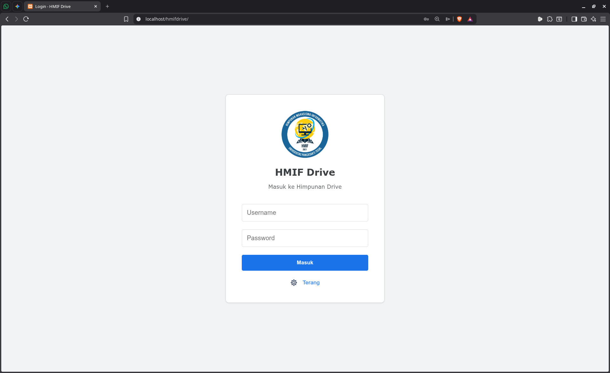
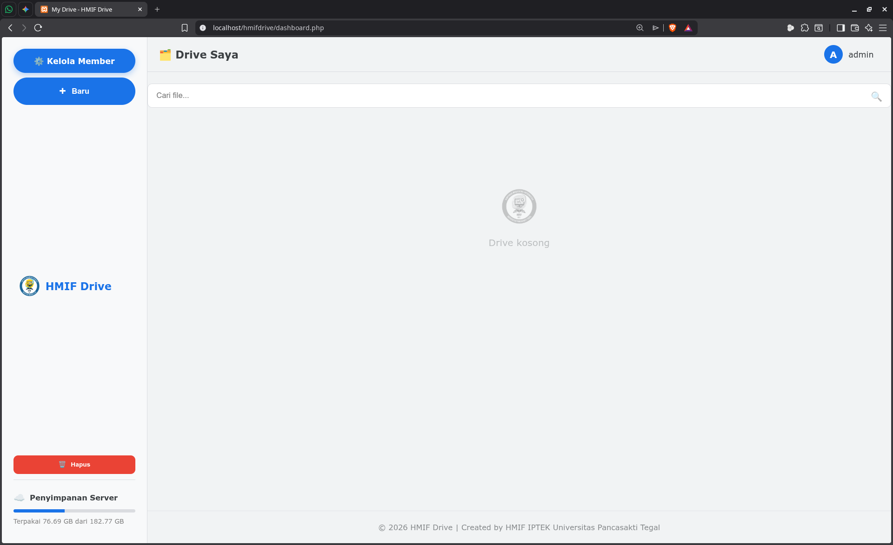

# HMIF Drive



**HMIF Drive** is a web-based storage management platform designed for student organizations to manage user access and monitor server disk capacity in real-time.

## 🚀 Features

* **Member Management**: Add, delete, and manage roles (Admin/User).
* **Disk Monitoring**: Real-time storage visualization with low-space alerts.
* **Security**: CSRF Protection, Password complexity validation, and Session management.
* **UI/UX**: Dark/Light mode support and fully responsive design.

## 🛠️ Quick Installation (Linux)

You can deploy this project quickly by running the following commands in your terminal. This will clone the repository, set the correct permissions, and prepare the environment.

```bash
# 1. Clone the repository
git clone [https://github.com/YOUR_USERNAME/hmif-drive.git](https://github.com/YOUR_USERNAME/hmif-drive.git)

# 2. Move into the directory
cd hmif-drive

# 3. Set directory permissions (Crucial for disk monitoring)
# Replace 'www-data' with your web server user if necessary
sudo chown -R www-data:www-data .
sudo chmod -R 755 .

# 4. Create the database configuration
# Edit config/db.php with your database credentials
nano config/db.php
```
## 📋 Prerequisites
* **Web Server:** Apache or Nginx.

* **PHP:** Version 7.4 or newer (with mysqli extension).

* **Database:** MySQL or MariaDB.

## 📄 License
Developed by HMIF IPTEK Universitas Pancasakti Tegal.

© 2026 HMIF Drive.
